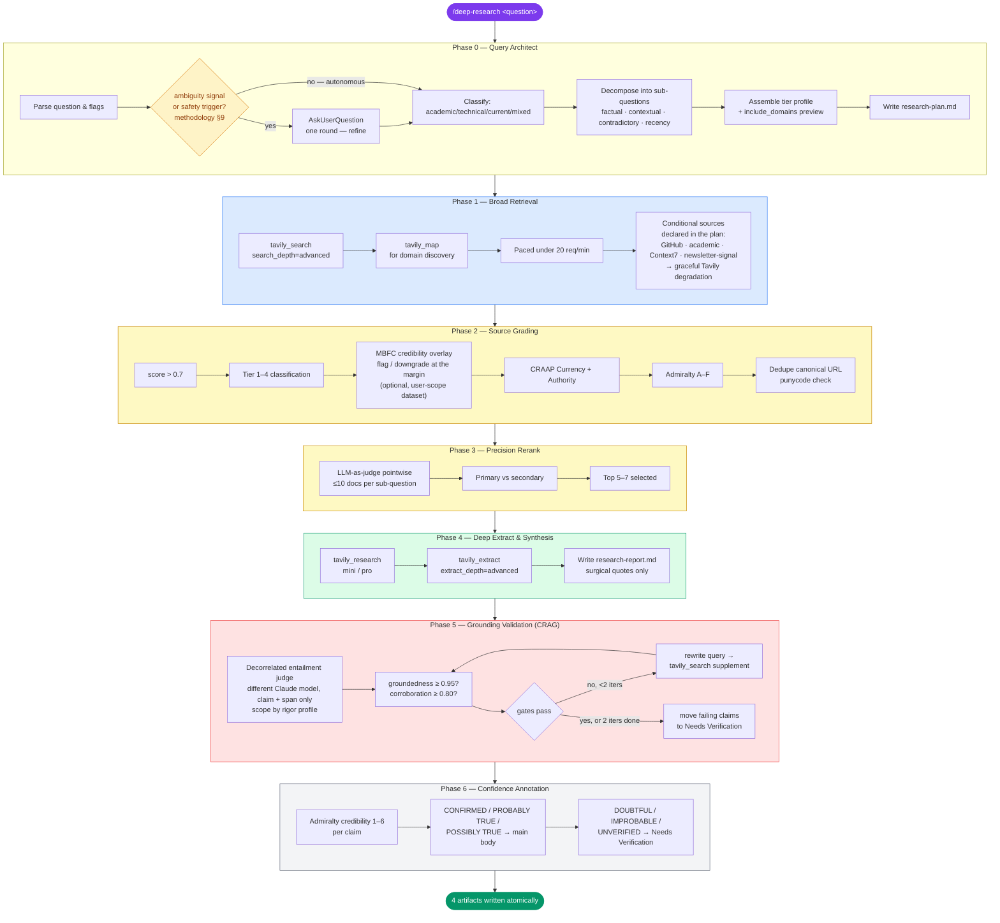
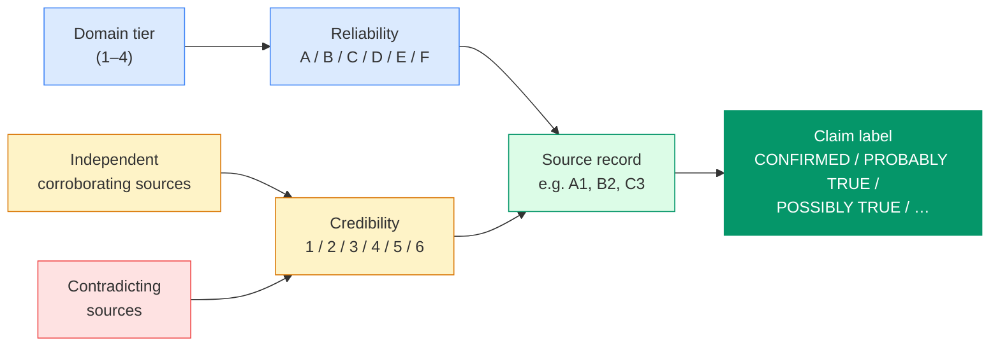
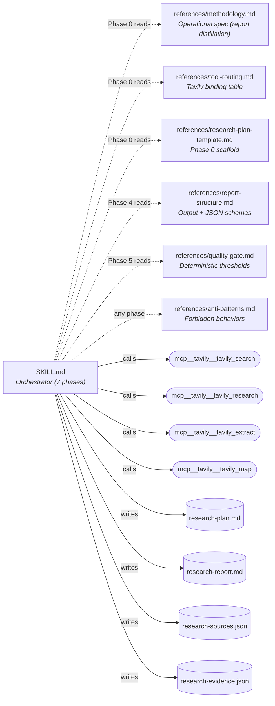

<p align="center">
  <strong>Deep Research</strong>
</p>

<p align="center">
  <em>Intelligence-grade multi-source research as a Claude Code skill — source-graded, autonomous-capable, evidence-anchored.</em>
</p>

<p align="center">
  
  
  
  
  
</p>

<p align="center">
  
  
  
</p>

---

Point it at a research question. It decomposes the question into orthogonal sub-questions, retrieves across a tiered domain registry with Tavily, grades every source on the NATO Admiralty 2×6 matrix, and hands you a report where every claim traces to a URL and an explicit confidence label. Exhaustive runs reach **100+ sources**. Quality is held to absolute gates — groundedness, source-quality, corroboration, and a decorrelated entailment judge — verified per run, not against an external product.

> **Why does this exist?** LLM research agents confidently synthesize from SEO farms unless you force source discipline. Anthropic's own internal research system found that *"early agents consistently chose SEO-optimized content farms over academic PDFs, even when authoritative sources were retrievable."* The fix is not better prompting alone. It is a **source-grading harness that runs before the synthesis step** — tier registry, score threshold, Admiralty reliability, CRAAP authority check, LLM-as-judge rerank, CRAG grounding loop. This skill bakes all of that into a 7-phase pipeline that **runs autonomously**, pausing for a single clarifying question only when the query is genuinely ambiguous — so an orchestrating agent can drive it unattended, yet an ambiguous question is refined with you before a single Tavily credit is spent.

---

## What You Get

Four artifacts in your invocation directory, written atomically at the end of the run.

```
research-plan.md         # the run's plan, written in Phase 0
research-report.md       # final synthesis, inline citations, confidence tags
research-sources.json    # every cited source, Admiralty-graded
research-evidence.json   # claim → source mapping, credibility 1–6
```

Exactly four — always. The optional [`--suggest-tooling`](#companion-skill-tooling-recommender) flag adds a fifth file (`research-toolbox.md`) written by a *separate* companion skill, not the engine; the four-artifact contract stays intact.

### `research-report.md` excerpt

```markdown
# Impact of the EU AI Act on open-source model providers in 2026

> Research date: 2026-04-17 · Length: short
> Source count: 16/28 · Tier 1/2 share: 94% · Median date: 2025-09-08

## Executive summary

- GPAI obligations under Articles 53–55 entered application on 2 August 2025,
  with systemic-risk provisions applying above the 10²⁵ FLOPs threshold.[^1][^2]
- The open-source exemption (Article 2(5g)) excludes free and open-source
  GPAI models from several transparency obligations unless they meet the
  systemic-risk threshold.[^1][^3] [CONFIRMED]

## 1. GPAI provisions in force in 2026

Under Article 53 of Regulation (EU) 2024/1689 [...].[^1][^4] The European AI
Office published its Code of Practice on 2025-07-10 [...].[^5] [CONFIRMED]

## Contradictions & open debates

The scope of "sufficiently detailed summary" of training data remains disputed.
The Commission's July 2025 template[^5] is interpreted by Meta[^6] as [...],
while Mozilla[^7] argues [...]. [POSSIBLY TRUE — contested]

## Needs Verification

- Claim that compliance costs exceed €1M for small open-source providers —
  rests on a single trade-press source[^12] without regulatory corroboration.

## Sources

[^1]: Regulation (EU) 2024/1689 — eur-lex.europa.eu — Tier 1, Admiralty A1
[^2]: European AI Office GPAI guidance — digital-strategy.ec.europa.eu — Tier 1, A1
[...]
```

### `research-evidence.json` schema

```json
{
  "claim_id": "C001",
  "claim_text": "GPAI obligations under Articles 53–55 entered application on 2 August 2025.",
  "supporting_source_ids": ["S001", "S002"],
  "contradicting_source_ids": [],
  "admiralty_credibility": 1,
  "label": "CONFIRMED",
  "corroboration_count": 2,
  "independent_tier12_count": 2,
  "primary_source_present": true
}
```

Every claim in the report has a record. No URL is fabricated; no claim is silent about its provenance.

---

## Quick Start

### Install

```bash
gh repo clone hashbulla/deep-research ~/.claude/skills/deep-research
```

Claude Code discovers the skill automatically. No restart needed.

### Run

```bash
# Standard run, language inferred from the question
/deep-research impact of EU AI Act on open-source model providers in 2026

# Exhaustive run in French, with recency and custom domains
/deep-research --length exhaustive --lang fr \
  --since 2025 --domains anthropic.com,mistral.ai \
  comparaison LangGraph / CrewAI / AutoGen / Claude Agent SDK

# Narrow factual with recency gate
/deep-research --since 2025 prompt caching cost-performance tradeoffs
```

### Prerequisites

| Requirement | Why | Check |
|:------------|:----|:------|
|  | Runtime for the skill | `claude --version` |
|  | Synthesis quality and Admiralty discipline benefit from top-tier reasoning | `/model opus` |
|  | Every retrieval call. `WebSearch` is fallback only. | Visible in `/mcp` |
|  | Installing from this repo, and GitHub deep research (SOTA-repo discovery). Absent → graceful Tavily degradation | `gh auth status` |
|  | Runs `scripts/verify_gates.py` (stdlib-only, zero network) for deterministic gate verification | `python3 --version` |
|  | Version-current library docs on technical runs naming a dependency. Absent → graceful Tavily degradation | Visible in `/mcp` |
|  | Folds the maintainer's curated daily briefs into work-relevant runs as a routing signal. Absent → graceful Tavily degradation | `ls ~/.claude/deep-research/newsletter-corpus/` |

> **Verify Tavily is registered before invoking:**
>
> ```bash
> claude mcp list | grep tavily
> ```
>
> If the grep returns no match, register the Tavily remote MCP server at user scope (see [Troubleshooting](#troubleshooting)). The skill halts at Phase 0 with an explicit error if `mcp__tavily__*` tools are not visible.

### Invocation flags

| Flag | Values | Default | Effect |
|------|--------|---------|--------|
| `--length` | `short` \| `standard` \| `exhaustive` | `standard` | Calibrates sub-question count, recall breadth, source target (15–25 / 35–60 / **100+**) |
| `--lang` | ISO 639-1 | inferred | Output language of `research-report.md` |
| `--since` | `YYYY` or `YYYY-MM-DD` | inferred | Lower bound on source publication date |
| `--domains` | comma list | tier profile | Additional allowlist appended to the tier profile |
| `--exclude` | comma list | tier blocklist | Additional blocklist |
| `--profile` | `academic` \| `technical` \| `current-affairs` \| `mixed` | inferred | Selects `include_domains` baseline from the tier registry |
| `--min-corroboration` | int ≥ 1 | `2` | Min independent Tier 1/2 sources required to mark a claim CONFIRMED |
| `--model` | `opus` \| `fable` | `opus` | Synthesis tier — Claude-Code-native (session model + subagent overrides, zero API keys). Fable 5 is opt-in at ~2× cost ([details](references/model-tiers.md)) |
| `--confidential` | flag | off | Confidential-path run: subagents receive neutral references only; rigor escalates ([details](references/model-tiers.md)) |
| `--rigor` | `standard` \| `critical` | `standard` (`critical` implied by `--confidential`) | Verification depth — entailment-judge scope, refuse-if-no-source, mandatory anchors, sycophancy probe ([details](references/quality-gate.md)) |
| `--suggest-tooling` | flag | off | After Phase 6 completes, delegate the finished run to the `suggest-tooling` sibling skill, which proposes work-relevant Claude Code skills, plugins, and MCP servers and writes `research-toolbox.md`. Default OFF — runs are byte-identical without it. The engine still emits exactly the four artifacts; `suggest-tooling` is a separate skill that writes the 5th file and never auto-installs anything. |

---

## Pipeline



### Pre-flight Refinement

The skill runs **autonomously** by default: Phase 0 writes `research-plan.md` and proceeds straight to retrieval. It pauses for a single `AskUserQuestion` round **only when** the query trips a named ambiguity signal — no scope boundary, undefined comparison axis, ambiguous timeframe, unspecified depth, or undefined audience/jurisdiction — or a safety trigger (a sub-Tier-2 `--domains` entry, or a likely-false premise under `--rigor critical`). A well-formed query never pauses, so an orchestrating agent can drive the skill unattended; an ambiguous one is refined with you before a single Tavily credit is spent. The checklist is authoritative in [`references/methodology.md` §9](references/methodology.md).

| Refinement | Fires when | Time |
|:-----|:--------|:-----|
|  | A named ambiguity signal or safety trigger trips — otherwise the run is fully autonomous | 0–2 min |

---

## Source Grading

Three overlapping disciplines, applied deterministically in Phase 2 and probabilistically in Phase 3.

### 1. The tier registry

Every domain classified before any content enters the synthesis prompt. Based on Anthropic's internal finding that unconstrained agents drift toward SEO content.

| Tier | Examples | Admiralty reliability | Usage |
|:----:|:---------|:---------------------:|:------|
| **1** | `arxiv.org`, `pubmed.ncbi.nlm.nih.gov`, `nature.com`, `*.gov`, `*.europa.eu`, `who.int` | **A** | Primary sources; preferred in `include_domains` |
| **2** | `anthropic.com`, `openai.com`, `reuters.com`, `ft.com`, `docs.python.org`, `gartner.com` | **B** | Default retrieval baseline (Tier 1+2 union) |
| **3** | `techcrunch.com`, `wired.com`, `arstechnica.com`, `substack.com` (institution-affiliated) | **C** | Acceptable only with corroboration from Tier 1/2 |
| **4** | `reddit.com`, `x.com`, `linkedin.com`, `medium.com` | **D–F** | Never primary. Social-signal pointers only, in a labeled `Signals` subsection |

Full list in [`references/methodology.md §6`](references/methodology.md).

> **OSINT/SOCMINT note.** Account-graded social sources (verified institutional accounts on Tier 4 platforms, SOCMINT extracts) are citable under the account-reliability sub-rubric in `references/osint-retrieval.md` — Admiralty reliability 2/3/4 by account identity, never by platform. Stealth retrieval (scrapling MCP, rung 3 of the OSINT escalation ladder) is **optional and capped**: absent scrapling MCP → rung 3 disabled, graceful Tavily degradation. Default cap is 12 stealth dispatches per run (`--max-stealth`), recorded in the Methodology note.

### 2. NATO Admiralty 2×6 matrix

Two orthogonal axes: **reliability** of the source, **credibility** of the information after corroboration. Every cited source carries a reliability letter; every claim in `research-evidence.json` carries a credibility digit.



Credibility rules are deterministic — no LLM fluency-weighted guessing. The table renders the normative precedence cascade in [`references/methodology.md §4.1`](references/methodology.md) (first matching row wins; the cascade wins on any divergence):

| Credibility | Condition (first match wins) | Label |
|:-----------:|:----------|:------|
| 1 | ≥2 independent Tier 1/2 sources agree, no Tier 1/2 contradictor | **CONFIRMED** |
| 2 | ≥1 Tier 1 source and no contradictor; or ≥2 Tier 1/2 with exactly 1 contradictor | **PROBABLY TRUE** |
| 3 | Single Tier 1/2 source, no contradictor (Tier 3 corroboration does not upgrade) | **POSSIBLY TRUE** |
| 4 | ≥1 Tier 1/2 support and ≥1 equally authoritative contradictor | **DOUBTFUL** |
| 5 | Contradicted by ≥2 Tier 1/2 sources | **IMPROBABLE** |
| 6 | Only Tier 3/4 support, or zero supporting sources | **UNVERIFIED** |

Labels 4/5/6 cannot appear in the main report body — they route to the **Needs Verification** section with an explicit reason.

### 3. Quality gates

Applied post-synthesis. Failing a gate triggers a CRAG re-query loop (up to 2 iterations per sub-question) before any claim ships.

| Gate | Threshold | Failure action |
|------|:---------:|:---------------|
| Groundedness | ≥ 0.95 | CRAG re-query for unsupported claims |
| Source quality | ≥ 0.80 Tier 1/2 | Expand allowlist, re-retrieve |
| Coverage | ≥ 0.90 sub-questions | Add follow-up sub-question |
| Freshness | Median within `--since` window | Add recency sub-question |
| Corroboration rate | ≥ 0.80 | Re-query; else → Needs Verification |

Full thresholds in [`references/quality-gate.md`](references/quality-gate.md).

---

## Architecture

Seven-phase orchestrator, single `SKILL.md` entry point, methodology externalized into reference files loaded on demand.



### File structure

```
~/.claude/skills/deep-research/
├── .claude/CLAUDE.md                      # Maintainer spec anchor — invariants, gotchas, conventions
├── SKILL.md                               # Orchestrator — 7 phases, pre-flight refinement, provenance block
├── deep-research-report.md                # Methodology source of truth (cited below)
├── scripts/
│   ├── verify_gates.py                    # Deterministic gate verification (stdlib-only, zero network)
│   ├── github_rank.py                     # Composite GitHub-repo ranking (scoring only, zero network)
│   └── academic_graph.py                  # Dual-track paper ranking + BibTeX/RIS export (zero network)
└── references/
    ├── methodology.md                     # Full distillation — tier registry, Admiralty, CRAAP, CRAG
    ├── tool-routing.md                    # Tavily MCP tool selection per intent
    ├── report-structure.md                # research-report.md structure + JSON schemas
    ├── quality-gate.md                    # Deterministic thresholds, CRAG triggers
    ├── anti-patterns.md                   # Non-negotiables (no fabricated URLs, no WebSearch, etc.)
    ├── research-plan-template.md          # Phase 0 scaffold
    ├── model-tiers.md                     # Model-tier policy (opus default, fable opt-in)
    ├── github-research.md                 # GitHub SOTA-repo discovery (sharding, expert prior, fake-star gate)
    ├── academic-research.md               # Scholarly pipeline (open graph, dual-track, OA-only ingestion)
    ├── newsletter-signal.md               # Curated-feed routing source (local FTS5 corpus, never cited)
    └── examples.md                        # Worked examples (read on demand)
```

### Design decisions

| Decision | Choice | Rationale |
|:---------|:-------|:----------|
| Primary retrieval | `tavily_search search_depth=advanced` | Per-phase control; Tavily already reranks semantic chunks |
| Synthesis for narrow sub-questions | `tavily_research model=mini\|pro` | Delegates the inner Perplexity-style loop where useful |
| Stage-2 rerank | LLM-as-judge (≤10 docs) | Cohere Rerank / cross-encoders not available as MCP; judge approximates cross-encoder accuracy |
| Pre-context filtering | Inline Claude reasoning on Tavily results | Anthropic's Dynamic Filtering is API-side only; inline filtering achieves equivalent discipline |
| Source grading | NATO Admiralty 2×6 | Intelligence-grade provenance, usable by humans, deterministic |
| Contradiction handling | Dedicated report section | Report §1 stage 4 — never silent, never auto-resolve between equally authoritative sources |
| Gate verification | `scripts/verify_gates.py` (stdlib-only, zero network) | Counts, ratios, medians, cascade conformance, and the CWD-report SHA-256 are script-verified at runtime — LLM-self-reported metrics are not gates |
| Conditional retrieval sources | GitHub / academic / Context7 / newsletter-signal, gated at Phase 0 | Declared in the plan, fire only when relevant; any absent MCP/CLI/credential/corpus degrades gracefully to Tavily-only and is recorded in the Methodology note |
| Newsletter-signal grading | Routing signal, never a citable record | The brief seeds retrieval; the pointed-to URL is graded normally and tagged `surfaced via newsletter-signal corpus <date>`. Avoids circular "my own digest said so" authority |
| Rigor profiles | `standard` default · `critical` (implied by `--confidential`) | The everyday instrument stays fast; high-stakes runs escalate to entailment-on-every-claim, refuse-if-no-source, mandatory anchors, and a Phase-0 sycophancy probe |
| Model selection | Claude-Code-native (session model + subagent overrides), zero API keys | Consumers are Claude Max users without keys; Opus 4.8 default, Fable 5 opt-in via `--model`, no SDK client |
| Fidelity judge | Decorrelated subagent on a *different* Claude model, claim + span only | Breaks same-model self-evaluation circularity without an external key; external Gemini/GPT judges were evaluated and dropped (zero-key contract) |

---

## Companion skill: tooling recommender

`suggest-tooling` is a sibling skill in this repository. It consumes a finished `/deep-research` run and proposes the Claude Code **skills, plugins, and MCP servers** worth adopting to act on what the research surfaced — relevance-ranked against your work profile and **trust-graded for supply-chain safety**. It never installs anything.

| Property | Detail |
|:---------|:-------|
| **Invoke** | `/suggest-tooling <run-dir>`, or set `--suggest-tooling` on a deep-research run to delegate automatically at the end of Phase 6 |
| **Six discovery channels** | GitHub, the MCP Registry, Claude Code marketplaces, Vercel skills, Smithery, and awesome-* lists (seed-only) — each independently degradable |
| **Trust tiers** | `VERIFIED` · `MAINTAINED` · `COMMUNITY` · `CAUTION`, derived deterministically from official/verified-namespace status, signed provenance, maintenance recency, and a fake-signal divergence gate — kept **orthogonal** to the relevance rank |
| **Never auto-installs** | Install commands are shown as text, never executed. Every listing and README is untrusted data (anti-pattern A6) — parsed for identifiers, never obeyed |
| **Output** | `research-toolbox.md` + a `research-toolbox.json` sidecar (the 5th artifact) |
| **Determinism** | Ranking and tiering run entirely in `suggest-tooling/scripts/marketplace_rank.py` — stdlib-only, zero-network, zero-LLM — reusing the fake-star divergence gate extracted from `scripts/github_rank.py` |

It was itself designed by dogfooding a `/deep-research` run on the discovery landscape; that graded report is kept under [`docs/superpowers/`](docs/superpowers/) as the design's evidence base.

---

## Troubleshooting

<details>
<summary><strong>Tavily MCP not registered</strong></summary>

The skill halts at Phase 0 if `mcp__tavily__*` tools are not visible. Register the Tavily remote MCP server at user scope:

```bash
claude mcp add --scope user tavily --transport http https://mcp.tavily.com/mcp/
```

Then re-invoke.
</details>

<details>
<summary><strong>Tavily rate limit (429)</strong></summary>

Research endpoint is capped at 20 req/min. The skill backs off at 30s → 60s → 120s. On persistent 429, affected sub-questions degrade automatically to `tavily_search` + manual decomposition. Documented in the Methodology note of the final report.
</details>

<details>
<summary><strong>Exhaustive run came back with &lt; 100 sources</strong></summary>

The skill runs a single expansion round — allowlist broadened to the Tier 1+2 union, 2–4 contextual/recency sub-questions added — before proceeding to Phase 4. If it still falls short after that round, it proceeds anyway and the Methodology note documents why (e.g., narrow topic, paywall-dominant domain). The 100+ target is a quality calibration, not a hard contract.
</details>

<details>
<summary><strong>A claim I expected to see ended up in Needs Verification</strong></summary>

The corroboration threshold is `--min-corroboration 2` by default. A single Tier 1 source with no second independent corroborator yields credibility 2 (PROBABLY TRUE); a single Tier 2 source yields credibility 3 — both still in the main body with inline tags. Credibility 4–6 (contradicted, only Tier 3/4 support, etc.) routes to Needs Verification. Raise `--min-corroboration 3` for stricter runs, or examine `research-evidence.json` for the exact support graph.
</details>

<details>
<summary><strong>I want to override the tier profile</strong></summary>

Use `--profile academic|technical|current-affairs|mixed` or pass `--domains` directly. User-specified domains are unioned with the tier profile; they are never silently dropped. Any `--domains` entry below Tier 2 trips a one-round `AskUserQuestion` confirmation in Phase 0 before retrieval, and the decision is recorded in `research-plan.md`.
</details>

<details>
<summary><strong>Output language mismatch</strong></summary>

`--lang` wins over the question's language. The skill preserves original-language proper nouns (legislation names, institution names, paper titles) inside the translated report to keep citation traceability.
</details>

---

## Extending

| Goal | How |
|:-----|:----|
| **Tune the tier registry** | Edit [`references/methodology.md §6`](references/methodology.md). Add domains to Tier 1/2; rebuild the include_domains preview at the top of the plan template. |
| **Adjust quality gates** | Edit [`references/quality-gate.md`](references/quality-gate.md). Thresholds are deterministic; raising groundedness to 0.98 simply triggers more CRAG iterations. |
| **Add a sub-question category** | Edit `SKILL.md` Phase 0 step 4 and mirror in [`references/research-plan-template.md`](references/research-plan-template.md). |
| **Change default length calibration** | Edit the "Length calibration" table in [`references/methodology.md`](references/methodology.md). |
| **Swap Tavily for another MCP** | Edit [`references/tool-routing.md`](references/tool-routing.md) and the Phase 1 / Phase 4 call templates in `SKILL.md`. Keep the grading phases intact — they are MCP-agnostic. |
| **Feed the newsletter-signal corpus** | Drop redacted `briefs/YYYY-MM.jsonl` files (schema: [`tests/schema/newsletter-corpus-record.schema.json`](tests/schema/newsletter-corpus-record.schema.json)) into `~/.claude/deep-research/newsletter-corpus/` — user-scope, outside this repo, sibling to `experts.yaml`. A producer (e.g. a newsletter agent) commits them via the GitHub Contents API; the skill reads a local clone. See [`references/newsletter-signal.md`](references/newsletter-signal.md). |
| **Tune the tooling recommender** | Edit `suggest-tooling/references/tooling-categories.md` (the closed category taxonomy) and the hat weights in `~/.claude/deep-research/tooling-hats.json` (user-scope; template ships as `suggest-tooling/tooling-hats.json.example`). The category set is parity-checked against the ranker in CI. |

---

## Roadmap

### Shipped

| Status | Capability |
|:------:|:--------|
|  | 7-phase pipeline with autonomous pre-flight refinement |
|  | NATO Admiralty 2×6 grading with deterministic credibility assignment |
|  | CRAG grounding loop (2 iterations max, graceful Needs-Verification fallback) |
|  | Unicode homograph defense (punycode normalization of every domain) |
|  | 100+ source exhaustive calibration |
|  | Conditional retrieval sources — GitHub SOTA-repo discovery, academic open-graph pipeline (OpenAlex / arXiv / Semantic Scholar), Context7 docs |
|  | Newsletter-signal conditional source — folds the maintainer's curated daily briefs into work-relevant runs via a local FTS5 corpus (routing signal, never cited) |
|  | Claude-Code-native model tiers (Opus default, Fable 5 opt-in) + `critical` rigor profile |
|  | Decorrelated entailment judge (different Claude model) — breaks LLM-as-judge circularity with no external key |
|  | MBFC credibility overlay on the tier registry (flag / downgrade at the margin) |
|  | Citation graph export — BibTeX / RIS for academic handoff |
|  | Five-layer eval harness + frozen benchmark test set, secret-gated CI judges |
|  | [`suggest-tooling`](#companion-skill-tooling-recommender) companion skill + `--suggest-tooling` delegation flag — trust-graded skill/plugin/MCP recommender across six discovery channels, never auto-installing |

### Planned

| Status | Item | Notes |
|:------:|:-----|:------|
|  | Langfuse live observability (Path A) — Claude Code OTEL → OTEL Collector (redaction) → Langfuse Cloud | Per-run cost / latency / tool-call spans + sanitized prompt/completion content. Zero code in the skill (instrumentation at the harness layer). Tracks AI-182. |
|  | Langfuse offline eval (Path B) — artifact → Datasets + Scores uploader | Replays the four run artifacts through the five-layer judges and pushes Datasets / Runs / Scores to Langfuse as a cross-run quality leaderboard. Extends the eval harness; lives in a maintainer tool outside `scripts/` (zero-network contract). Tracks AI-182. |

### Considered / deferred

| Status | Item | Why |
|:------:|:-----|:----|
|  | Exa `findSimilar` / Valyu full-text academic index | Evaluated during the 0.3.0 academic-pipeline work; the open-graph pipeline (OpenAlex / arXiv / Semantic Scholar) shipped instead. Revisit only if a recall benchmark shows a material gap, and only as an optional, key-gated source |
|  | External-model judge (Gemini / GPT-4) | Superseded by the decorrelated Claude judge above; the zero-API-key contract (consumers are Claude Max users) rules out external providers |
|  | Quality benchmark *vs* Perplexity Deep Research | The harness ships with absolute quality gates instead — groundedness, source-quality, corroboration, entailment — tracked per run over a frozen test set. Perplexity is no longer the reference comparator |

---

## Research Foundation

The full methodology is in [`deep-research-report.md`](deep-research-report.md) — a standalone intelligence brief on state-of-the-art web search techniques for AI agents. The `references/methodology.md` file is a near-verbatim distillation of that report, with every skill rule back-referenced to its source section (`[R§n]`).

The report synthesizes these sources, each directly wired into a specific part of the skill:

| Source | Used for | Skill location |
|:-------|:---------|:---------------|
| [Perplexity Deep Research](https://www.perplexity.ai/hub/blog/introducing-perplexity-deep-research) | 5-stage retrieve-reason-refine loop, tiered source preference | SKILL.md Phase 0–6 shape |
| [Anthropic · Multi-agent research system](https://www.anthropic.com/engineering/built-multi-agent-research-system) | Orchestrator-worker pattern, "start wide then narrow", SEO-farm failure mode | Phase 1 parallel retrieval, prompt structure |
| [Anthropic · Web search tool (domain controls)](https://docs.claude.com/en/docs/build-with-claude/tool-use/web-search-tool) | `allowed_domains` / `blocked_domains`, Unicode homograph defense | Phase 2 domain normalization |
| [Anthropic · Building effective agents](https://www.anthropic.com/research/building-effective-agents) | Extended / interleaved thinking, source quality as first-class metric | Phase 0 decomposition, Phase 3 rerank |
| [Anthropic · Agent evaluation guide (2026)](https://www.anthropic.com/engineering/claude-evals) | Groundedness + Coverage + Source Quality triad | Phase 5 CRAG gates |
| [Tavily API documentation](https://docs.tavily.com/) | `search_depth=advanced`, `include_domains`, `score` filter, Research endpoint | Phase 1, Phase 4 tool routing |
| [Corrective RAG (CRAG)](https://arxiv.org/abs/2401.15884) | Post-synthesis claim grading and re-query loop | Phase 5 |
| [LevelRAG / PRISM query decomposition](https://arxiv.org/abs/2502.18139) | CoT decomposition patterns for multi-hop queries | Phase 0 |
| [NATO Admiralty source grading](https://en.wikipedia.org/wiki/Admiralty_code) | A–F × 1–6 matrix for intelligence-grade provenance | Phase 2, Phase 6 |
| [CRAAP Test](https://library.csuchico.edu/craap-test) | Currency · Relevance · Authority · Accuracy · Purpose automation | Phase 2 filter gates |
| [OSINT five-step validation](https://www.osintframework.com/) | Independent corroboration, primary-source chain, confidence-trap defense | Phase 5, anti-patterns |

A curated domain tier registry (≈ 60 Tier 1 domains + ≈ 40 Tier 2) is embedded in [`references/methodology.md §6`](references/methodology.md). Full bibliography and methodology rationale in [`deep-research-report.md`](deep-research-report.md).

---

## Repository layout

```
deep-research/
├── .claude/CLAUDE.md                      # maintainer spec anchor
├── README.md                              # this file
├── LICENSE                                # MIT
├── SKILL.md                               # skill entry point
├── deep-research-report.md                # methodology source of truth
├── scripts/
│   ├── verify_gates.py                    # deterministic gate verification (stdlib-only, zero network)
│   ├── github_rank.py                     # composite GitHub-repo ranking + exported fake_star_gate() (zero network)
│   ├── academic_graph.py                  # dual-track paper ranking + BibTeX/RIS export (zero network)
│   ├── newsletter_search.py               # newsletter-signal corpus search (in-memory FTS5, zero network)
│   └── eval_harness/                      # 5-layer verification harness (judge prompts + secret-gated CI runner)
├── experts.yaml.example                   # anonymous template — the real seed lives user-scope, outside the repo
├── references/
│   ├── methodology.md
│   ├── tool-routing.md
│   ├── report-structure.md
│   ├── quality-gate.md
│   ├── anti-patterns.md
│   ├── research-plan-template.md
│   ├── model-tiers.md                     # model-tier policy (opus default, fable opt-in)
│   ├── github-research.md                 # GitHub SOTA-repo discovery
│   ├── academic-research.md               # scholarly open-graph pipeline
│   ├── newsletter-signal.md               # curated-feed routing source (local FTS5 corpus)
│   └── examples.md                        # worked examples (read on demand)
├── suggest-tooling/                       # companion skill — trust-graded tooling recommender
│   ├── SKILL.md                           # entry point, 6-connector orchestration, no-auto-install
│   ├── references/                        # tooling-discovery / tooling-categories / toolbox-output
│   ├── scripts/marketplace_rank.py        # composite rank + trust tiers (stdlib-only, zero network)
│   ├── tooling-hats.json.example          # hat-weight template (real file lives user-scope)
│   └── evals/                             # loading + e2e fixtures for the five failure modes
├── docs/superpowers/                      # design specs, plans, and the dogfood research run
├── examples/eu-ai-act-2026/               # end-to-end fixture (4 artifacts, gate-conformant)
├── evals/                                 # loading / progressive / e2e + sycophancy-probes + benchmark-testset + rubric
├── CHANGELOG.md                           # semver release history (append-only)
├── gotchas-log.md                         # maintainer traps + perishable-asset cadences
├── tests/                                 # cross-reference / provenance / schema / invariant checks
│   ├── check-cross-references.sh
│   ├── check-provenance.sh
│   ├── check-schema.sh
│   ├── check-example-invariants.sh
│   ├── check-newsletter-search.sh
│   ├── check-marketplace-rank.sh          # suggest-tooling ranker unit + regression checks
│   ├── schema/{research-sources,research-evidence}.schema.json
│   └── fixtures/ → examples/eu-ai-act-2026/*.json
└── .github/workflows/validate.yml         # CI — runs the check suite on push + PR
```

### Sync model

The canonical copy is this repository. If you symlink instead of clone (e.g., `ln -s "$PWD" ~/.claude/skills/deep-research` from a working directory that holds the repo), edits propagate to Claude Code immediately. The default `gh repo clone hashbulla/deep-research ~/.claude/skills/deep-research` install creates a regular clone — commit upstream from that directory to publish changes.

---

<p align="center">
  
</p>
